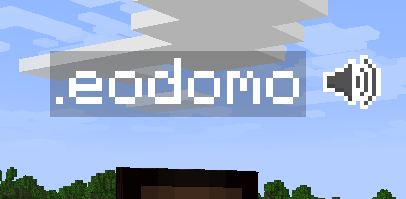
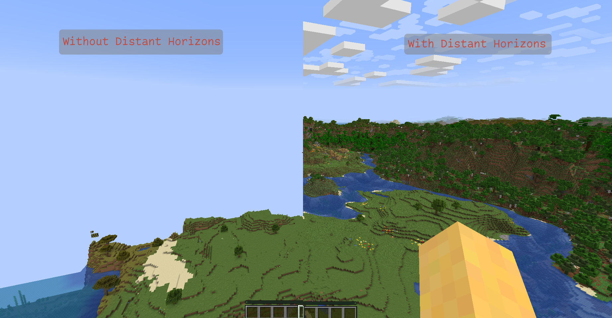
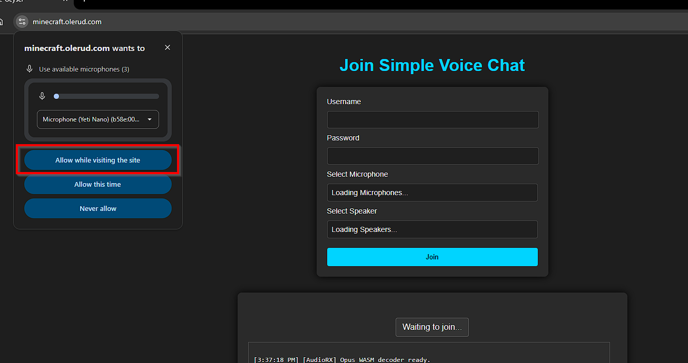

+++
date = '2026-07-28T23:46:52-04:00'
draft = false
title = 'Joining the Minecraft server'
categories = ["Minecraft", "Games"]
+++

This server is set up to allow Java and Bedrock edition players to play together! In both cases, the server address is `minecraft.olerud.com`. Come join now!

## Java Edition
Join the server at `minecraft.olerud.com` now!

### Get Eric's Mods
If you don't want to deal with reading about each mod you should get, [here](eric_mods.mrpack) is a download link for the modpack that Eric uses. Just download [Modrinth](https://modrinth.com/app), launch it, choose the option "Install instance from a file", and then launch it from Modrinth.

### Optional Mods
The server is set up to support a few mods for Java players. You can run these in either [Fabric](https://fabricmc.net/) or [Forge](https://files.minecraftforge.net/net/minecraftforge/forge/). If you are new to modding, I recommend installing a mod management client like [Modrinth](https://modrinth.com/) to get started.

#### Simple Voice Chat
[Simple Voice Chat](https://modrinth.com/plugin/simple-voice-chat) adds proximity chat to Minecraft! The server is set up to handle voice chat so you can talk to your friends in game. Even Bedrock players can join the chat (see below)!

#### Distant Horizons
[Distant Horizons](https://modrinth.com/mod/distanthorizons) greatly increases the max view distance in Minecraft.

The server is set up to support the Distant Horizons mod, so you can see things very far away.

----
## Bedrock Edition
Join the server at `minecraft.olerud.com` now!

### Voice Chat
Proximity voice chat in Bedrock works without any mods; instead, it runs through a website that you keep open in the background. If you don't have a computer on hand, your phone should work fine.

#### Steps to connect to voice chat
1. Connect to the server. You **MUST** be connected to the server before you can join the voice chat.
2. Type `/svg` in the chat. This will open a window for controlling the voice chat. Choose "Set Password". **DO NOT** re-use a password you have used previously. I'm not confident in the security of these passwords being stored. If you need to make up a new password, you can generate one [here](https://www.dinopass.com/).

3. Go to [https://minecraft.olerud.com](https://minecraft.olerud.com) in a web browser.
4. If it asks to use your microphone, click accept.

5. Sign in with your Minecraft username and the password you just created.

> [!TIP]
> If you have trouble joining, try putting a '.' before your username. I've seen it add a dot to the start for Bedrock players.

### Bedrock Limitations
The server is running Java edition, so some Bedrock features you are used to may not work. For example, Java edition doesn't have emotes, so other players will not see if you use an emote.

