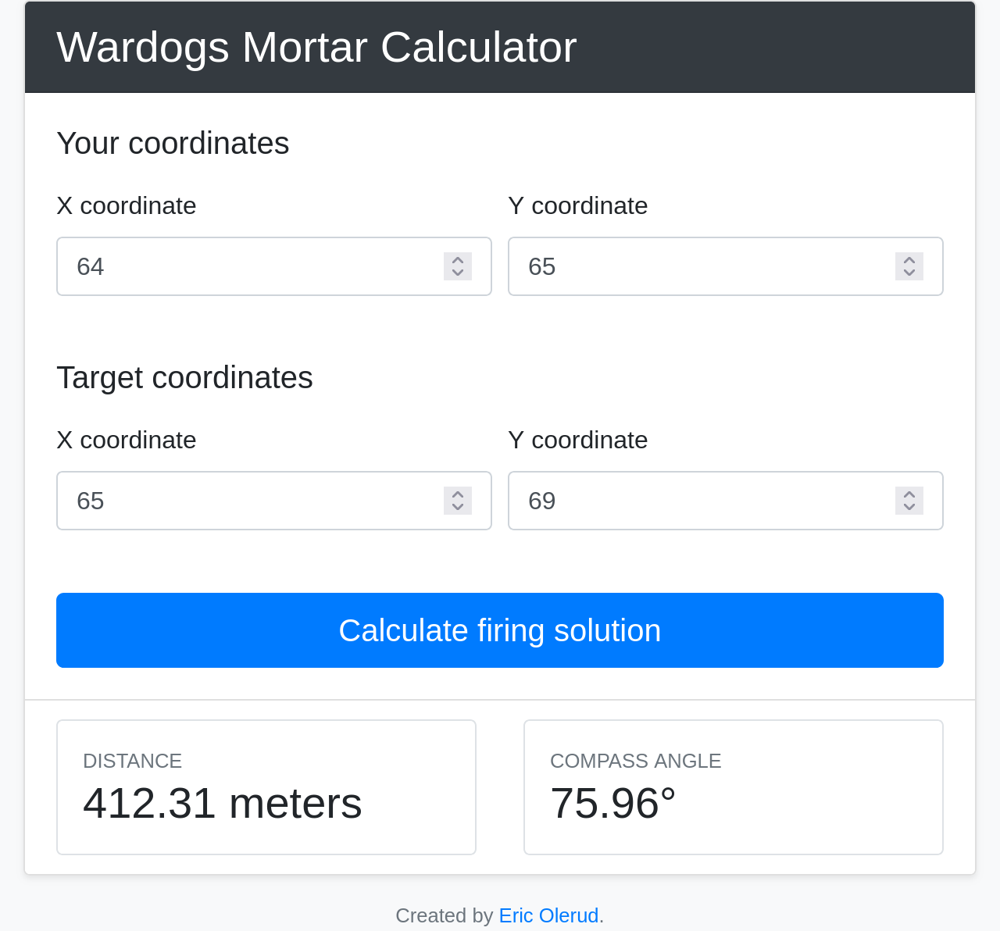

+++
date = '2026-09-20T00:55:25-04:00'
draft = false
title = 'Wardogs Mortar Calculator'
+++

I built a mortar trajectory calculator for Wardogs! This is currently accessible at https://wardogs.olerud.com.

To use it, open the map in Wardogs, hover over your current position to get your coordinates, and hover over the target position to get the target's coordinates. Plug those into the calculator, and then adjust the mortar to the parameters listed at the bottom of the page.

## Why did I do this?
This seemed like a simple enough task to accomplish and combines a bunch of skills I've been practicing. In the end, I had a working prototype of everything in under 2 hours, and I had the page published on my website in about 4 hours.

## How did you do it?
The app is written in Go, and it just does the trajectory math when you hit submit.

The hardest part was actually getting the UI to look decent. My "first draft" had nothing, it was basically just a list of text boxes and a button. Then I called on everything I learned about Bootstrap sometime last year to clean it all up.

## I want to contribute!
The source code is available at https://github.com/eodomo/mortar_calc, and the Docker image is at [veg3mite/mortar_calc](https://hub.docker.com/repository/docker/veg3mite/mortar_calc/general).
